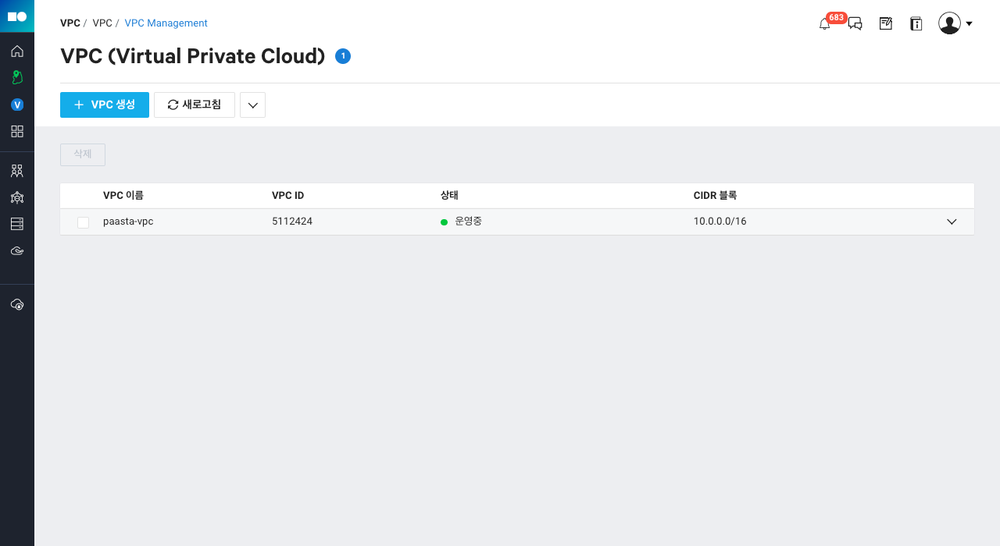
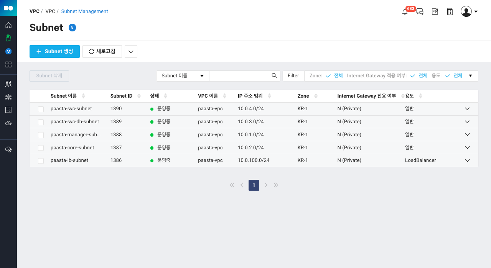
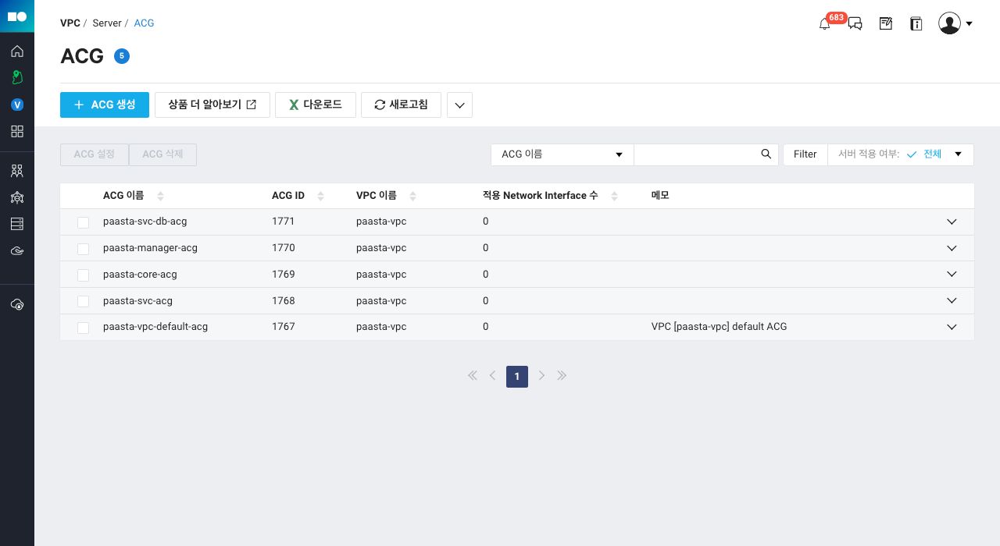

# Terraform PaaS-TA on Ncloud Network

Terraform을 활용하여 PaaS-TA on Ncloud 생성 시 필요한 VPC 네트워크 설정을 쉽게 구성할 수 있습니다.

## 준비하기

Terraform `0.13` 버전 이상을 설치해야 합니다.

- [Terraform](https://www.terraform.io/downloads.html)

## 사용법

저장소 루트 경로의 `ncloud.tf` 파일 내에 **[API 인증키](https://www.gov-ncloud.com/mypage/manage/authkey)**, **Region** 정보를 설정합니다.

```hcl
terraform {
  required_providers {
    ncloud = {
      source = "NaverCloudPlatform/ncloud"
    }
  }
  required_version = ">= 0.13"
}

provider "ncloud" {
  access_key = "__API_ACCESS_KEY__"
  secret_key = "__API_SECRET__"
  // 수도권: KR, 남부권: KRS
  region      = "KR"
  // NCLOUD_API_GW 환경 변수를 사용하는 경우 아래 site 설정을 제외해야 합니다.
  // https://github.com/NaverCloudPlatform/terraform-provider-ncloud/blob/master/ncloud/provider.go#L63-L72
  site        = "gov"
  support_vpc = true
}
```

ncloud provider 설정을 한 후 아래 명령을 root 폴더에서 수행할 수 있습니다.

> 기본 설정된 VPC 네트워크 구성을 변경하려면 `infra.tf` 파일 내의 설정을 수정해서 사용할 수 있습니다.

- `terraform init`: 플러그인 설치 e.g. NaverCloudPlatform/ncloud
- `terraform plan`: 정의된 리소스의 생성, 수정 및 삭제 계획 확인
- `terraform apply`: 정의된 리소스 적용
- `terraform destroy`: 생성된 리소스 제거

## 기본 설정된 네트워크 구성

### VPC



### Subnet



### ACG


